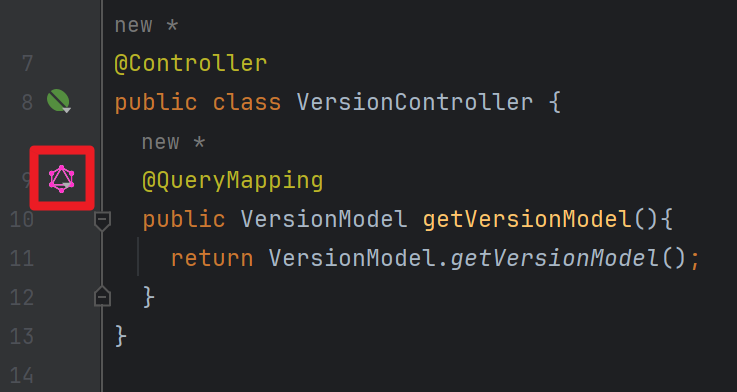

## GraphQL Project 생성 및 신규 스키마 연동

이번 문서에서는 간단한 GraphQL 프로젝트 를 생성하고, 신규 스키마를 연동해봅니다. 살펴볼 내용들은 아래와 같습니다.

- GraphQL 라이브러리 생태계 현황
- GraphQL Project 생성
- 신규 스키마 생성 및 연동


<br/>


## 예제 Github

이번 예제는 아래의 링크에서 확인하실 수 있습니다.

- https://github.com/chagchagchag/example-java-graphql/tree/main/v1_graphql_simple

<br/>


# GraphQL 라이브러리 생태계 현황

현재는 더 이상 유지보수되지 않고 Archived 된 상태의 라이브러리들 (Deprecated)

-  graphql-java / graphql-java-spring : https://github.com/graphql-java/graphql-java-spring
- graphql-java-kickstart / graphql-spring-boot : https://github.com/graphql-java-kickstart/graphql-spring-boot

<br/>

위의 라이브러리들을 기반으로 조금 더 통합되고 유지보수가 편리하도록 Spring / Netflix 에서 제공하게 된 라이브러리 들은 아래와 같습니다.

- spring-project / spring-graphql : https://github.com/spring-projects/spring-graphql
- Netflix / dgs-framework : https://github.com/Netflix/dgs-framework

<br/>

이번 문서에서는 GraphQL Project 생성시 spring-graphql 을 사용합니다.<br/>

<br/>


# GraphQL Project 생성

## 프로젝트 생성

start.spring.io 에서 선택한 라이브러리는 아래와 같습니다.


<br/>

위에서 선택한 라이브러리 외에도 별도로 추가해준 라이브러리가 있는데,  `전체 의존성` 챕터에서 정리합니다.<br/>


## 전체 의존성

build.gradle.kts

```kotlin
plugins {
	java
	id("org.springframework.boot") version "3.3.0"
	id("io.spring.dependency-management") version "1.1.5"
}

group = "io.chagchagchag.graphql"
version = "0.0.1-SNAPSHOT"

java {
	toolchain {
		languageVersion = JavaLanguageVersion.of(21)
	}
}

configurations {
	compileOnly {
		extendsFrom(configurations.annotationProcessor.get())
	}
}

repositories {
	mavenCentral()
}

dependencies {
	implementation("org.springframework.boot:spring-boot-starter-data-jpa")
	implementation("org.springframework.boot:spring-boot-starter-graphql")
	implementation("org.springframework.boot:spring-boot-starter-web")

	// (1) security 
	// implementation("org.springframework.boot:spring-boot-starter-security")

	// (2) graphql-scalars
	implementation("com.graphql-java:graphql-java-extended-scalars:21.0")

	// h2
	runtimeOnly("com.h2database:h2")

	// lombok
	compileOnly("org.projectlombok:lombok")
	annotationProcessor("org.projectlombok:lombok")

	testImplementation("org.springframework.boot:spring-boot-starter-test")
	testImplementation("org.springframework:spring-webflux")
	testImplementation("org.springframework.graphql:spring-graphql-test")
	testRuntimeOnly("org.junit.platform:junit-platform-launcher")

	// webflux test
	testImplementation("org.springframework:spring-webflux")
}

tasks.withType<Test> {
	useJUnitPlatform()
}
```

<br/>


(1) : `org.springframework.boot:spring-boot-starter-security` 

- graphql 에서의 인증 방식을 정리하기 위해 추가했습니다.
- 이번 문서에서는 간단한 예제 컨트롤러를 동작해야 하는데 allow 목록에 추가하는 코드까지 작성하기에는 예제가 복잡해지기에 주석처리합니다.

<br/>


(2) : `com.graphql-java:graphql-java-extended-scalars:21.0` 

- graphql java 라이브러리를 위한 추가적인 Scalar 타입을 제공하는 라이브러리
- `spring-boot-starter-graphql` 에서 기본으로 제공되는 graphql 스펙에는 기본적인 Scalar 타입들(Int, Float, String, Boolean, ID)이 포함되어 있습니다. 
- `graphql-java-extended-scalars` 라이브러리에서는 Date, DateTime, Time, Json, BigDecimal, BigInteger 등과 같은 다양한 타입을 추가적으로 제공합니다. 

<br/>


# 신규 스키마 생성 및 연동

graphql 프로젝트를 생성하면 아래와 같이 `src/main/resources/graphql` 디렉터리가 생성된 상태로 프로젝트가 생성됩니다. 만약 `src/main/resources/graphql` 디렉터리가 없다면 새로 생성해주시기 바랍니다.


<br/>


## 스키마 생성, Version 타입 생성

> 참고: Intellij 내의 GraphQL 플러그인을 설치하시면 조금 더 쉽게 스키마를 작성 가능합니다.<br/>
>
> 
>
> <br/>
>
> 

<br/>


**schema.graphqls**<br/>

`src/main/resources/graphql/schema.graphqls` 파일을 생성하고 아래와 같이 스키마를 정의합니다.

```plain
type Query {
    getVersionModel: VersionModel # (1)
}

type VersionModel { # (2)
    name: String,
    releaseDate: String
}
```

<br/>


(1)

- getVersionModel 이라는 Query 를 정의했고, return 타입은 VersionModel 입니다.
- VersionModel type 은 (2) 에서 정의합니다.
- 여기에서 정의하는 VersionModel 같은 타입명은 뒤에서 작성할 Controller 의 반환 타입 및 Java 모델 코드와 이름이 일치해야 정상적으로 동작합니다.
- getVersionModel 이라고 정의한 query 함수 명은 뒤에서 작성할 Controller 의 `@QueryMapping` 이 적용된 메서드와 정확하게 일치해야 정상적으로 동작합니다.


(2)

- VersionModel 이라는 type 을 정의합니다.
- GraphQL 이론 문서에서 살펴봤듯, Schema 는 type, query, mutation, directives 로 이뤄집니다.
- 위에서는 그 중 type 이라는 것을 VersionModel 이라는 이름으로 정의했습니다.
- 여기에서 정의하는 VersionModel 같은 타입명은 뒤에서 작성할 Controller 의 반환 타입 및 Java 모델 코드와 이름이 일치해야 정상적으로 동작합니다.


<br/>


## Version 모델 정의

Presentation 계층에 보여줄 모델을 정의합니다. (데이터 계층은 아닙니다.)<br/>

인터넷에 Entity 코드를 그대로 QueryMapping 등에 노출시키는 예제가 많은데, 제 경우에는 초반 스터디 시에 GraphQL 은 무조건 Entity 가 Query 에 매핑되어야 하는건가? 하고 착각을 했던 것 같습니다. 직접 스터디를 해보다보니 GraphQL 의 QueryMapping 시에 사용할 데이터 타입과 Entity 는 별개의 개념이라는 것을 알게 되었습니다.<br/>


**VersionModel.java** 

- 뷰 계층에 보여줄 객체이기에 record 를 활용했습니다.
- 아시는 분들은 많으시겠지만, record 를 엔티티에 사용하면 toString(), equals() 가 무작위로 생기기 때문에, record 를 엔티티에 사용하는 경우는 없으리라고 생각됩니다.

```java
package io.chagchagchag.graphql.v1_graphql_simple.version.model;

import java.util.Date;

public record VersionModel (String name, Date releaseDate){
  public static VersionModel getVersionModel(){
    return new VersionModel("1.0.0", new Date());
  }
}
```

<br/>


## Controller 정의

간단한 컨트롤러를 정의합니다. Schema 파일인 `schema.graphqls` 에 정의해둔 `getVersionModel` 이라는 Query 함수를 실행하는 Controller 입니다. <br/>

Spring for GraphQL 은 컨트롤러의 URL Mapping 에 대해 GraphQL 의 schema 내에 정의한 Query 가 매핑될 수 있도록 `@QueryMapping` 이라는 애노테이션을 제공합니다. 마찬가지로 schema 내에 정의한 Mutation 에 대해서는 컨트롤러에서 사용할 수 있도록 `@MutationMapping` 이라는 애노테이션을 제공합니다.<br/>


**VersionController.java**

```java
package io.chagchagchag.graphql.v1_graphql_simple.version.rest;

import io.chagchagchag.graphql.v1_graphql_simple.version.model.VersionModel;
import org.springframework.graphql.data.method.annotation.QueryMapping;
import org.springframework.stereotype.Controller;

@Controller
public class VersionController {
  @QueryMapping
  public VersionModel getVersionModel(){
    return VersionModel.getVersionModel();
  }
}
```

<br/>


정상적으로 GraphQL 의 schema 와 Spring MVC의 `@QueryMapping` 이 잘 맞았다면 아래와 같이 GraphQL 아이콘이 `@QueryMapping` 좌측에 나타납니다.



`@QueryMapping` 에 대해 GraphQL 아이콘이 나타나지 않는다면 가능한 원인은 다음과 같습니다.

- schema 파일에 정의한 type 과 @QueryMapping 에 사용한 type 명이 다르다. 
  - → Java 타입명과 schema 내에 정의한 type 명이 정확하게 일치해야 합니다.
- schema 파일에 정의한 query  명과 @QeuryMapping 을 적용한 메서드 명이 다르다.
  - → `QueryMapping` 은 schema 내의 query 명과 대응되기에 `QueryMapping` 과 schema 내에 정의한 query 명을 일치시켜야 합니다.

<br/>


## 테스트

Intellij 의 http client 는 `.http` 파일을 생성하면 REST API 를 테스트 하기 편하게 해줍니다. GraphQL 역시도 http client 를 이용해서 테스트가 가능합니다.<br/>


`src/main/test/http` 디렉터리를 생성하고 `version_model.http` 파일을 생성합니다.


<br/>


그리고 `src/main/test/http/version_model.http` 파일의 내용을 아래와 같이 작성해줍니다.

**src/main/test/http/version\_model.http**

```http
GRAPHQL http://localhost:8080/graphql

{
    getVersionModel {
        name
        releaseDate
    }
}
```

<br/>


WAS 서버를 구동합니다.


<br/>


version\_model.http 파일을 열어서 Run 버튼을 클릭합니다.


<br/>


아래와 같이 정상적인 Response 를 출력한다면 정상적으로 수행된 것입니다.

