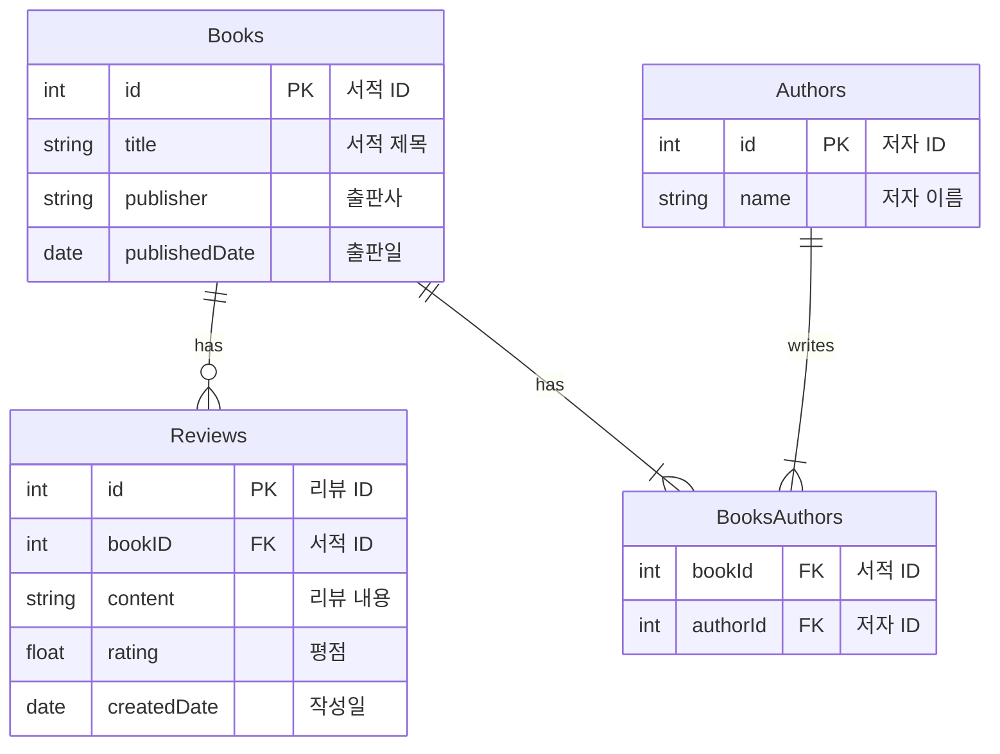

## Schema 정의 & 데이터베이스 연동

> TODO : ERD 예제를 나중에 다른 주제로 바꿀 예정

<br/>


## mermaid 

ERD 를 표시하기 위해 mermaid 라고 하는 파일 형식을 사용하였으며, github 등에서는 시각화된 형태로 확인 가능하며, intellij 에서는 mermaid 라고 하는 플러그인을 설치하셔야 ERD를 확인하실 수 있습니다.


<br/>


## ERD

ERD 는 아래와 같습니다.  책에 대한 리뷰, 책의 저자에 대한 테이블 매핑입니다.



<br/>


## query, mutation 명세서 작성

간단하게 어떤 Query, Mutation 를 사용할지를 정의해보면 아래와 같습니다.

```plain
## Authors
query
- getAllAuthors
- getAuthorById

mutation
- addAuthor


## Books
query
- getBookById
- getBooks
- getBooksByAuthorName

mutation
- addBook
- deleteBook


## Reviews
query
- getReviewsByBookId

mutation
- addReview
- deleteReviewById

```

<br/>


## Query 작성

schema.graphqls 파일 내에 Query 항목에 대해 아래의 내용을 정의합니다.

```plain
type Query {
    getVersionModel: VersionModel # (1)

    ## Author
    getAllAuthors: [AuthorModel]
    getAuthorById(id: ID!): AuthorModel

    ## Book
    getBookById(id: ID!): BookModel
    getBooks: [BookModel]
    getBooksByAuthorName(authorName: String): [BookModel]

    ## Review
    getReviewsByBookId(id: ID!): [ReviewModel]
}
```

<br/>


## Mutation 작성

schema.graphqls 파일 내에 Mutation 항목에 대해 아래의 내용을 정의합니다.

```plain
type Mutation {
	## Author
    addAuthor(authorName: String): AuthorModel

    ## Book
    addBook(title: String!, publisher: String, publishedDate: String, authorIds: [ID!]): BookModel!
    deleteBook(id: ID!): DeleteBookResponse

    ## Review
    addReview(bookId: ID!, content: String, rating: Float): ReviewModel
    deleteReviewById(reviewId: ID!): DeleteReviewResponse
}
```

<br/>


## type 작성

type 은 mermaid 에 정의한 타입을 참고해서 어떤 타입인지를 명시해서 적어줍니다. 화면 한쪽에는 mermaid 파일을 띄워두고, 다른 한쪽에서는 graphqls 파일을 열어두어서 정의하면 됩니다.<br/>

schema.graphqls 

```plain

type AuthorModel {
    id: ID!
    name: String
    books: [BookModel]
}

type BookModel {
    id: ID!
    title: String!
    publisher: String
    publishedDate: Date
    authors: [AuthorModel]
    reviews: [ReviewModel]
}

type ReviewModel {
    id: ID
    book: BookModel
    content: String
    rating: Float
    createdDate: DateTime
}
```

<br/>


## 확장 스칼라 타입 정의

이전 문서에서도 설명했듯 이번 프로젝트에서는 아래의 라이브러리를 사용합니다. spring-boot-starter-graphql 에서 기본제공하는 Scalar 타입들 (Int, Float, String, Boolean, ID) 외에 Date, DateTime, Time, Json, BigDecimal, BigInteger 등과 같은 타입을 추가로 지원하고자 할 때 graphql-extended-scalars 를 사용합니다.

`com.graphql-java:graphql-java-extended-scalars:21.0` 

- graphql java 라이브러리를 위한 추가적인 Scalar 타입을 제공하는 라이브러리
- `spring-boot-starter-graphql` 에서 기본으로 제공되는 graphql 스펙에는 기본적인 Scalar 타입들(Int, Float, String, Boolean, ID)이 포함되어 있습니다. 
- `graphql-java-extended-scalars` 라이브러리에서는 Date, DateTime, Time, Json, BigDecimal, BigInteger 등과 같은 다양한 타입을 추가적으로 제공합니다. 

<br/>


schema.graphqls 

- 확장 scalar 타입들은 가급적 파일의 가장 위에 적어두는 것을 추천합니다.

```plain
scalar Date
scalar DateTime
scalar Long

# ...
```

<br/>


## Response 타입 정의

Response 객체 역시 GraphQL 이 인식할 수 있어야 하므로 별도로 schema.graphqls 파일에도 정의해줍니다.<br/>

schema.graphqls 

```plain
type DeleteBookResponse {
    success: Boolean!
}

type DeleteReviewResponse {
    success: Boolean!
}
```

<br/>


## Schema 전체 코드

완성된 Schema 의 전체 코드는 아래와 같습니다.

```plain
scalar Date
scalar DateTime
scalar Long

type Query {
    getVersionModel: VersionModel

    ## Author
    getAllAuthors: [AuthorModel]
    getAuthorById(id: ID!): AuthorModel

    ## Book
    getBookById(id: ID!): BookModel
    getBooks: [BookModel]
    getBooksByAuthorName(authorName: String): [BookModel]

    ## Review
    getReviewsByBookId(id: ID!): [ReviewModel]
}

type Mutation {
    ## Author
    addAuthor(authorName: String): AuthorModel

    ## Book
    addBook(title: String!, publisher: String, publishedDate: String, authorIds: [ID!]): BookModel!
    deleteBook(id: ID!): DeleteBookResponse

    ## Review
    addReview(bookId: ID!, content: String, rating: Float): ReviewModel
    deleteReviewById(reviewId: ID!): DeleteReviewResponse
}

type DeleteBookResponse {
    success: Boolean!
}

type DeleteReviewResponse {
    success: Boolean!
}

type VersionModel {
    name: String,
    releaseDate: String
}

type AuthorModel {
    id: ID!
    name: String
    books: [BookModel]
}

type BookModel {
    id: ID!
    title: String!
    publisher: String
    publishedDate: Date
    authors: [AuthorModel]
    reviews: [ReviewModel]
}

type ReviewModel {
    id: ID
    book: BookModel
    content: String
    rating: Float
    createdDate: DateTime
}
```

<br/>


