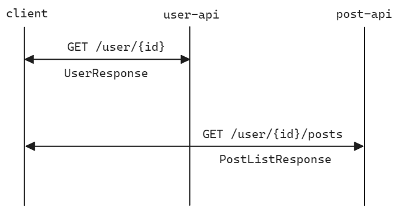
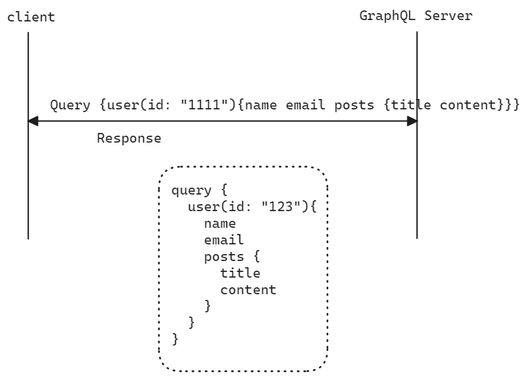

# GraphQL

## 참고자료

공식 자료

- [graphql-kr.github.io](https://graphql-kr.github.io/)
- [graphql-kr.github.io/learn](https://graphql-kr.github.io/learn/)

<br/>


블로그

- https://hahahoho5915.tistory.com/63
- https://tech.kakao.com/posts/364
- https://ivvve.github.io/2019/07/24/server/graphql/over-under-fetching/
- https://ziszini.tistory.com/154

<br/>


## 등장배경, FQL, GraphQL (todo)

> 이 부분은 책의 개념을 더 자세히 보고 정리 예정 

### 등장 배경

GraphQL, FQL 이 나타나게 된 것은 REST API 의 단점을 극복하기 위해 나타나게 되었습니다.<br/>

흔히 알려진 REST API 의 단점은 아래와 같습니다.

- over-fetching : API 호출 시 필요한 것 보다 더 많은 데이터를 가져오는 것을 의미합니다.
- under-fetching : Endpoint 하나로부터 충분한 데이터를 받지 못해 두개 이상의 Endpoint 에 요청을 해야 하는 것을 의미합니다.
- 복수의 엔드포인트 관리 : 클라이언트 측에서는 유사한 데이터를 가지고 있지만 조금씩 다른 엔드포인트 등과 같은 여러개의 API 엔드포인트를 관리해야 했습니다.

<br/>


### FQL

이런 REST API 의 한계를 극복하고자 Facebook 에서 FQL 이라고 하는 것을 만들었는데 SQL 과 유사한 문법을 가졌으며 소셜데이터에 최적화 되어있었습니다. 하지만, FQL 은 복잡하고 제한적이며 유연성이 부족하다는 단점이 있었고 개발 및 지원이 종료되었습니다.<br/>

<br/>


### GraphQL

- 타입시스템을 사용하며 강력한 쿼리 언어를 갖습니다.
- 효율적인 데이터 로딩, 캐싱을 지원합니다.
- 단일 엔드 포인트를 사용합니다.
  - REST API 에서는 복수개의 엔드포인트를 관리하는데, GraphQL 에서는 단일 엔드포인트를 관리합니다.

<br/>

단점으로는 아래와 같은 점들이 있습니다.

- 고정된 요청, 고정된 응답만 할 때는 query 로 인해 요청의 크기가 REST API 보다 커질 수 있습니다.
- 캐싱이 REST 보다 복잡합니다.
- 파일 업로드 구현 방법이 정해져있지 않기에 직접 구현해야 합니다.


GraphQL 은 완벽하게 REST API 를 대체하지는 못합니다. REST 에 적합한 서비스에는 REST 가 사용되는 것이 더 바람직합니다. 즉, 꼭 필요한 케이스를 파악해서 필요한 경우에만 GraphQL 을 사용하는 것이 권장됩니다.


## GraphQL 의 장점

### 클라이언트 중심의 Query

예를 들어 Client 에서 아래와 같은 형태의 쿼리를 보냈다고 해보겠습니다.

```json
{
    user(id: 333){
        id
        name
        isViewerFriend
        profilePicture(size: 50){
            uri
            width
            height
        }
        friendConnection(first: 5){
            totalCount
            friends {
                id
                name
            }
        }
    }
}
```

<br/>

서버측의 응답 역시 아래와 같이 클라이언트의 쿼리와 유사한 형태로 돌려받을 수 있습니다.

```json
{
    "data": {
        "user": {
            "id": 333
            "name": "Peter",
            "isViewerFriend" : true,
            "profilePicture": {
            	"uri" : "cdn://kakaocdn.img.net/.....",
            	"width": 25,
            	"height": 25
        	}
        },
    	"friendConnection": {
            "totalCount": 13,
            "friends": [
                {
                    "id": "1111",
                    "name": "Hallen"
                },
                {
                    "id": "2222",
                    "name": "Jordan"
                }
            ]
        }
    }
}
```

<br/>


### 단일 엔드 포인트

REST API 에서는 User 데이터와 Post 데이터를 가져올 때 두번의 API 호출이 일어납니다.



<br/>


GraphQL 을 사용할 경우에는 아래와 같이 단일 엔드포인트를 가지게 됩니다.



<br/>


### over-fetching, under-fetching 방지


Rest API 에 비해서 GraphQL 은 필요한 데이터만 가져오기 때문에 over-fetching, under-fetching 에 대해 단점이 보완됩니다.


## 타입 시스템 (todo : 그림추가 - 그림 그리는 것 스킵함)

GraphQL 은 타입시스템을 기반으로 데이터를 조회합니다.

<br/>


## GraphQL 의 Schema - type, query,mutation, directives

GraphQL 의 Schema 는 아래와 같은 요소들로 구성됩니다.

- Type : 데이터의 형식(Type) 을 정의하는 데에 사용됩니다.
- Query, Mutation : 조회(Query) 또는 수정(Mutation)에 사용됩니다.
- Directives : 쿼리(Query), 뮤테이션(Mutation) 의 실행방식을 제어하는 Directive (지시자) 입니다.


## GraphQL 의 type

GraphQL 은 type 이라고 하는 것을 통해 데이터 형식을 정의합니다. GraphQL 은 스키마를 확장하고 수정하는 데에 유연한 구조를 갖습니다. 기존 타입에 필드를 추가하는 것 도 가능하며 기존 타입을 확장(extends)해서 새로운 타입을 생성하는 것 역시 가능합니다.

```json
type User {
    id: ID!
    name: String!
    email: String!
}

type Query {
    user(id: ID!): User
    allUsers: [User!]!
}

type Mutation {
    createUser(name: String!, email: String!): User!
    updateUser(id: ID!, name: String, email: String): User!
	deleteUser(id: ID!): Boolean!
}
```

type 은 아래와 같은 타입들이 있습니다.

- Scalar Type (스칼라 타입) : 가장 기본적인 타입이며, 단일 값을 의미합니다.
  - e.g. String, Int, Float, Boolean, ID
- Object Type (객체 타입) : 여러 가지 필드 들을 가지고 있는 객체 타입을 의미합니다.
- Interface Type (인터페이스 타입) : GraphQL 에서 공유되는 필드의 타입을 정의할 때 사용합니다.
- Enum Type (열거형 타입) : enum 타입을 의미합니다.
- Union Type (유니온 타입) : 두개 이상의 여러 타입 중 하나일 수 있는 값을 의미합니다.
  - e.g. `union SearchResult = Product | Coupon`
- Input Object Type (입력 객체 타입) : 입력 객체 타입은 쿼리, 뮤테이션의 입력 매개변수로 사용되는 복합타입을 의미합니다. 주로 쿼리, 뮤테이션 내의 매개변수로 전달되는 데이터의 구조를 정의할 때 사용합니다.
- List 타입
  - List 는 배열 형태의 데이터를 의미하며 `[String!]!` 과 같이 `[타입]` 과 같은 표현식으로 표현 가능합니다.
- Non-Null 타입
  - Non-Null 은 Null 을 허용하지 않는 타입을 의미하며 `String!` 과 같이 `!` 으로 끝나는 타입을 의미합니다.

<br/>


### Scalar

가장 기본적인 타입이며, 단일 값을 의미합니다. (e.g. String, Int, Float, Boolean, ID)

<br/>


### Object

여러 가지 필드 들을 가지고 있는 객체 타입을 의미합니다.

```json
type Profile{
    userId: ID!
    pictureUrl: String
    birthday: Date
    bio: String
}

type User{
    id: ID!
    username: String!
    email: String!
    posts: [Post!]!
	profile: Profile
}
```

<br/>


### Interface

GraphQL 에서 공유되는 필드의 타입을 정의할 때 사용합니다. 인터페이스를 implements 하는 객체는 그 인터페이스의 모든 필드를 구현합니다.

```json
interface Node {
    id: ID!
}
    
type User implements Node{
    id: ID!
    username: String!
    email: String!
}

type Post implements Node{
    id: ID!
    title: String!
    content: String!
}
```

<br/>


### Enum

C++, Kotlin, Java 등의 언어에 존재하는 Enum 이라는 개념입니다.

```json
enum PaymentStatus{
    PAYMENT_FAIL,
    PG_API_CALL_FAIL,
    PG_API_CALL_SUCCESS,
    PAYMENT_COMPLETE
}

type Order{
    id: ID!
    username: String!
    payment_status: PaymentStatus
}
```

<br/>


### Union

두개 이상의 여러 타입 중 하나일 수 있는 값을 의미합니다.

```json
union SearchResult = Product | Coupon
```

<br/>


### Input Object Type

입력 객체 타입은 쿼리, 뮤테이션의 입력 매개변수로 사용되는 복합타입을 의미합니다. 주로 쿼리, 뮤테이션 내의 매개변수로 전달되는 데이터의 구조를 정의할 때 사용합니다.

```json
input createUserInput {
    username: String!
    email: String!
    password: String!
    age: Int
}

type Mutation {
    createUser(input: createUserInput!): User!
}
```

<br/>


### List & Non-Null 타입

List 는 배열 형태의 데이터를 의미하며 `[String!]!` 과 같이 `[타입]` 과 같은 표현식으로 표현 가능합니다.

Non-Null 은 Null 을 허용하지 않는 타입을 의미하며 `String!` 과 같이 `!` 으로 끝나는 타입을 의미합니다.

```json
type User {
    id: ID!
    username: String!
    emails: [String!]!
	posts: [Post]
}
```

<br/>


## 스키마 확장 (todo: 이 부분 조금 더  자료조사 필요)

> https://graphql-kr.github.io/learn/schema/

새로운 기능을 추가하고 데이터 모델을 확장하기 위한 목적으로 확장을 사용합니다. <br/>

위에서 정리했듯 스키마에는 Type, Query, Mutation, Directives 가 있습니다. 스키마를 확장하는 방법은 아래의 두 방법이 있습니다.

- 새로운 type 정의
- 기존 type 확장


### 새로운 type 정의

예를 들어 현재 Schema 에 User 라는 type 이 없다면 새로 추가해줍니다.

```json
type Mutation {
    createUser(name: String!, email: String!) User!
}

type User {
    id: ID!
    name: String!
    email: String!
}
```

<br/>


### 기존 type 확장

age 라는 필드가 새로 필요하면 어떻게 할까요? age 필드를 새로 추가하면 됩니다.

```json
type Mutation {
    createUser(name: String!, email: String!) User!
}

type User {
    id: ID!
    name: String!
    email: String!
    age: Int // 이 부분입니다.
}
```

<br/>


## 사용자 정의 스키마 타입

String, Int, Float, Boolean, ID 외의 특정 데이터 타입을 정의할 때 사용하는 타입을 의미합니다. <br/>


### e.g. 날짜

```java
GraphQLObjectType queryType = GraphQLObjectType.newObject()
    .name("Query")
    .field(field -> field
           .name("date")
           .type(ExtendedScalars.Date)
           .dateFetcher(environment -> "2024-06-08"))
    .build();
```

<br/>


### e.g. 이메일

```java
GraphQLObjectType queryType = GraphQLObjecttype.newObject()
    .name("Query")
    .field(field -> field
          .name("email")
          .type(ExtendedScalars.Email)
          .dataFetcher(environment -> "example@example.com"))
    .build();
```

<br/>


### e.g. 사용자 정의 스키마 타입 (Custom Scalar Type)

```java
public class CustomDateScalar {
    public static GraphQLScalarType dateScaler = GraphQLScalarType.newScalar()
        .name("Date")
        .description("Date Scalar Type")
        .coercing(new Coercing <LocalDate, String>(){
            @Override
            public String serialize(Object dateFetcherResult) throws CoercingSerializeException {
                if(dateFetcherResult instanceof LocalDate){
                    return ((LocalDate) dataFetcherResult).format(DateTimeFormatter.ISO_DATE);
                }
                throw new CoercingSerializeException("Invalid value for Date Scalar")
            }
            
            @Override
            public LocalDate parseValue(Object input) throws CoercingParseValueException{
                try{
                    return LocalDate.parse(input.toString(), dateTimeFormatter.ISO_DATE);
                }
                catch(Exception e){
                    throw new CoercingParseValueException("Invalid input for Date Scalar");
                }
            }
            
            @Override
            public LocalDate parseLiteral(Object input) throws CorercingParseLiteralException {
                try{
                    return LocalDate.parse(input.toString(), DateTimeFormatter.ISO_DATE);
                }
                catch (Exception e){
                    throw new CoercingParseLiteralException("invalid literal for date scalar");
                }
            }
        }).build();
}
```

<br/>


## GraphQL 쿼리

## GraphQL 쿼리 구성 요소

## Resolver 의 종류

## DataFetcher

## DataLoader

## GraphQL Resolver 사용시 유의사항


